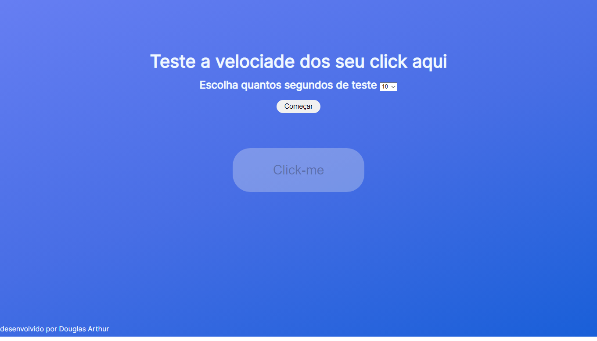

# Site para teste de CPS (clicks por segundos).

 ## Tecnlogias usadas:
* ### HTML
* ### CSS
* ### JAVA SCRIPT

## Foto da página.
<html>
    
</html>

# Link de acesso.

<html>
    <a href="https://douglasarthurr.github.io/Web-TestCPS/">Página</a>
</html>

#

# Autor

[ Douglas Arthur da Silva Bento](https://github.com/douglasarthurr)